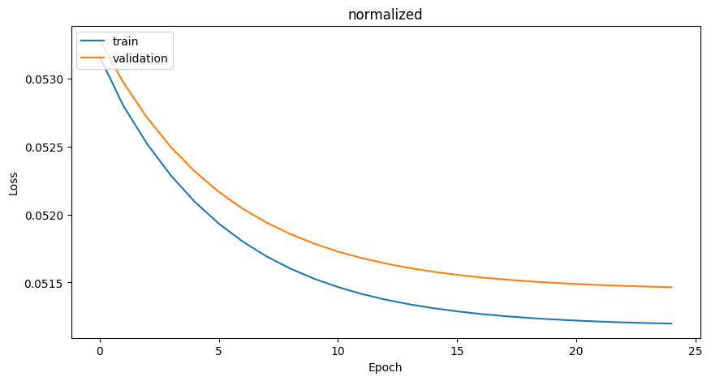
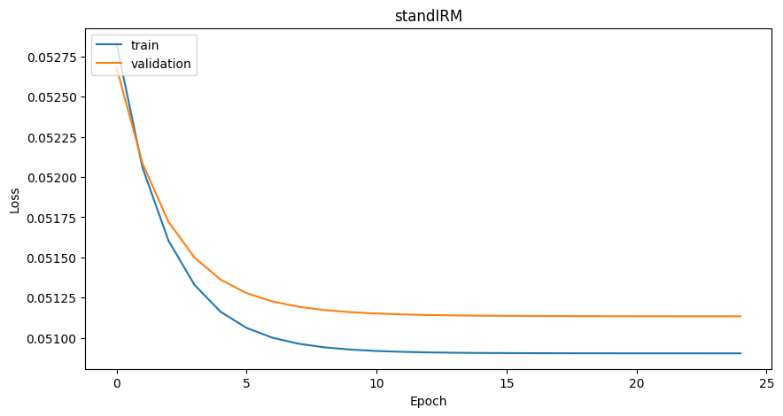
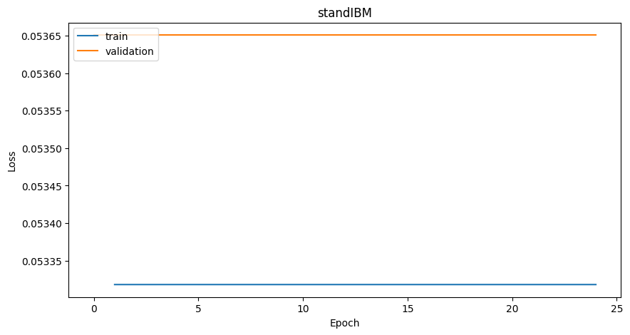
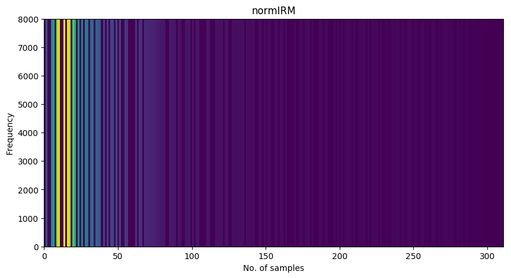
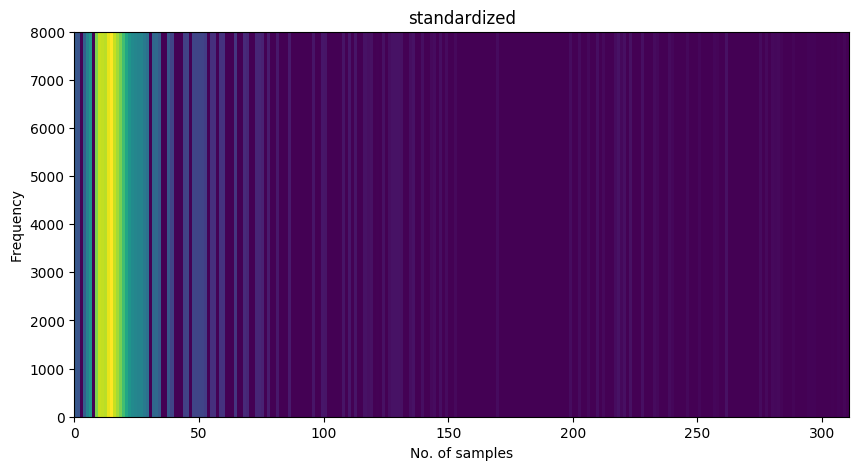

## HW3 Part III. Speech enhancement with DNNs

### Quesion 1

**Parts 1, 2. Finding min, max, mean, sd** 

The code for statistics calculation can be found in submission dierctory `py/calc_stats.py`. Comments provided within the file.

Example command to run the script:
```bash
python -d '/mapping_dicts/' -o './'
```
Wehere `-d` is the path to dictionaries and `-o` is the path for the output where graphs will be saved.

Graphs for minimum, maximum, mean and standard deviation are stored in `stat_graphs/` directory.

**Parts 3,4 data standartization and normalization**

Code for data standartization and normalization can be found at `py/normalization.py` in the submission directory. See comments in the file.

Graphs for minimum, maximum, mean and standard deviation of standardized and normalized data are stored in `stat_graphs/` directory.

### Question 2

**Part 1**

Mask functions are impemented in `py/save_data.py`. Functions `IBM`, `IRM` and `FFT`.

Plots for the corresponding clean speech, noisy speech and masked signal can be found in `masks/` directory. Masks were applied to the first speech signal from train data set.

`save_data.py` transforms the input data to standardized/normalized and applies masks. Transformations were performed for train and validation data sets and saved in separate `.npy` files. For more explanation see comments in `save_data.py` file and docstrings.

To launch the script paths to files should be changed.

**Part 2. Training DNNs**

Feed-forward NNs were trained using Keras Sequential API with the following parameters:

- 3 dense layers with 1024 nodes;
- ReLU activation function;
- Variance Scaling weight initializer;
- Loss: MSE;
- Optimizer: SGD;
- Batch size: 10000;
- Each model was trained for 25 epochs.

Code can be found in `py/build_model_keras.py` directory. Plots with the training history are stored in `models_hist/`.

Test script `test.py` saves predicted clean signal and plots STFTs of clean speech, noisy speech and enhanced speech.

### Model discussion and results

We were trying to run several models but every model had the same problem, at some point of training it was stuck on plato and loss did not change. As far as the model could not train properly we were unable to receive any resilts. 


Compare, for example, the following training history plots.






On the graphs we can see that loss is gradually nicely decreasing but since the values we are estimating are really small by themselves the loss of 0.05 is still large.

For standard IBM data model even did not start training



Consequently the plots of predicted output of such models do not look meaningful.





So the output audio files are just noise.
We tried to increase the number of training epochs till 50 and 200, it did not have any effect. The models were still stuck at plato.


It is likely that some errors were made during data preprocessing and standartization, normalization.

There was not much sense to continue training on the rest of the masks as the models were facing the same problem.

Traning history graphs are saved in `models_hist/` directory, audio files of model outputs and spectrograms can be found in the folder `predicted/`.